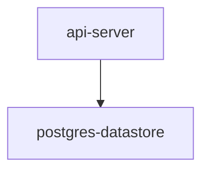

# Architecture

## System Overview

The myapp system is a Go application that serves HTTP requests via the api-server component.

## Components

- api-server: Found in cmd/server/main.go. Handles all HTTP traffic.

## Data Flow

Requests arrive at the api-server. GET /users retrieves records from postgres-datastore.
POST /users writes new records to postgres-datastore. [INFERRED]

## External Dependencies

- postgres-datastore: Primary relational datastore.
DATABASE_URL configures the connection string.

## Component Diagram

